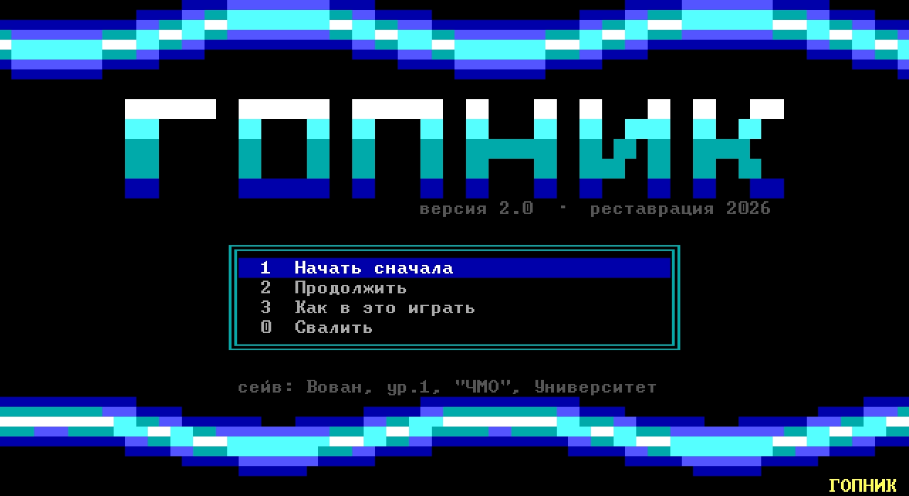
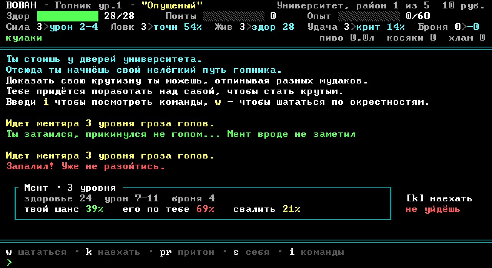
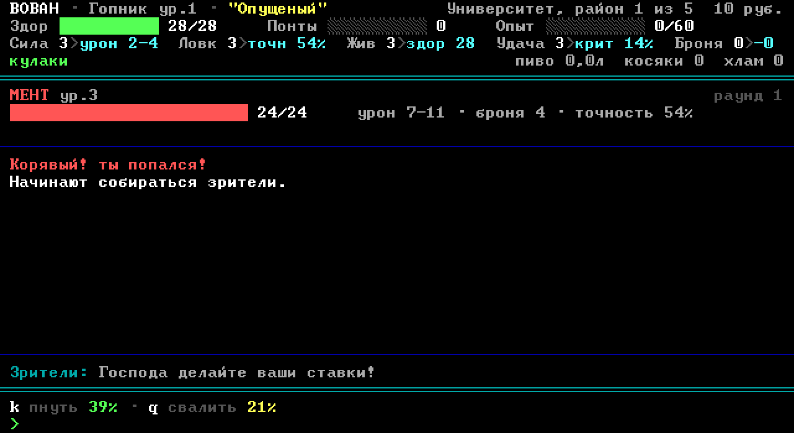

# Гопник

Текстовая игра про гопника: районы, драки, понтовость, притоны.

Реставрация «Гопник v1.02» (V.P., 2003). Оригинал — 16-битный DOS-бинарник на
Borland Pascal, на 64-битной Windows не запускается. Игра написана заново на C#;
механика, тексты, звания и формулы боя восстановлены из оригинального `g.exe`.



## Запуск

Скачать `Gopnik.exe` из [релизов](https://github.com/arty-s/gopnik/releases/latest)
и запустить. Ставить ничего не нужно: всё внутри одного файла, требуется только Windows.

`Alt+Enter` — полный экран. Сейв пишется рядом с исполняемым файлом.

## Сборка из исходников

Нужен [.NET 8 SDK](https://dotnet.microsoft.com/download/dotnet/8.0).

```
dotnet run --project Gopnik.csproj -c Release
```

Самодостаточный файл, как в релизе:

```
dotnet publish Gopnik.csproj -c Release -r win-x64 --self-contained true -p:PublishSingleFile=true -p:IncludeNativeLibrariesForSelfExtract=true -p:EnableCompressionInSingleFile=true -o release
```

| | |
|---|---|
|  |  |

## Устройство

Собственный текстовый режим, не консоль:

- сетка 80×25, ячейка 8×14, кадр 640×350 — текстовый режим EGA;
- масштабирование целыми пикселями, окно прилипает к кратному размеру;
- палитра — стандартные 16 цветов VGA;
- используются только глифы кодовой страницы 866.

Шрифт читается при запуске из системного `C:\Windows\Fonts\vga866.fon` —
это NE-контейнер с ресурсом FNT, откуда берутся растровые глифы 8×12
(`src/Engine/FontSource.cs`). Готовые битмапы в репозиторий не входят.

Ячейка на две строки выше глифа. Чтобы рамки и блоки при этом стыковались,
для диапазона `0xB0–0xDF` верхняя и нижняя строки глифа дублируются.

Эффекты (`src/Engine/Retro.cs`): копперы, плазма, скроллер, градиент логотипа.
Копперы рисуются символом `▀` с разными цветами символа и фона — две ступени
градиента на текстовую строку.

## Структура

```
src/Engine/     текстовый режим, шрифт, окно, эффекты
src/Game/       правила, данные, бой, мир, сохранения
src/Scenes/     экраны
tools/shots/    оффскрин-рендер сцен в PNG
tools/sim/      Monte-Carlo стенд баланса
```

Стенды работают без окна и не требуют запущенной игры:

```
dotnet run --project tools/shots/Shots.csproj -c Release -- out 7
dotnet run --project tools/sim/Sim.csproj -c Release -- 3000
```

## Своды правил

Арифметика боя выбирается в меню запуска, пункт «Правила»:

- **оригинал 2003** — формулы из встроенной справки как есть: точность
  `20 + Ловкость×5` с потолком 90%, урон `Сила/2 … Сила`, броня простым
  вычитанием, здоровье `10 + Живучесть×5 + Сила` у всех;
- **оригинал, бои короче** — то же самое, кроме здоровья врагов: справка
  оригинала описывала эту формулу только для игрока, и распространение её
  на врагов растягивает бой примерно вдвое;
- **переделанные 2026** — пересчёт: пологая шкала точности, броня всегда
  пропускает часть удара, короткие бои.

То же самое задаётся ключами `--classic` и `--modern`. Свод правил
запоминается в сейве: персонаж продолжает играть по тем правилам,
по которым создан.

## Откуда взяты числа

Тексты, названия, 43 звания понтовости и формулы — из строкового корпуса `g.exe`
и его встроенной справки.

Характеристики десяти уличных врагов извлечены из сегмента данных: таблица
из десяти четырёхбайтных записей в начале DGROUP, вплотную перед массивом имён.
Порядок полей (Сила, Ловкость, Живучесть, Удача) подтверждён кодом: процедура
осмотра берёт второе поле, умножает на пять, прибавляет двадцать и печатает
как «Точность #%», а на значении 14 переключается на «Точность 90%».

Оттуда же правило множественных ударов: сверх 14 ловкости каждые 18 очков
дают лишний удар, остаток — шанс ещё одного.

Характеристики ректора в таблице отсутствуют — она кончается на уличных типах,
поэтому его числа реконструированы. Все реконструкции помечены комментариями
в `src/Game/Model.cs` и `src/Game/Data.cs`.

Исправлен баг оригинала: финальный противник встречался только при въезде
в последний район, и после проигрыша ему игра становилась непроходимой.

## Благодарности

Оригинальная игра — **V.P., 2003**. Тексты, названия и устройство мира
принадлежат автору оригинала; это любительская реставрация. Если автор
попросит убрать — уберу.

## Лицензия

Код — MIT, см. [LICENSE](LICENSE). Лицензия покрывает код, но не тексты
и не игровой дизайн, унаследованные от оригинала.
